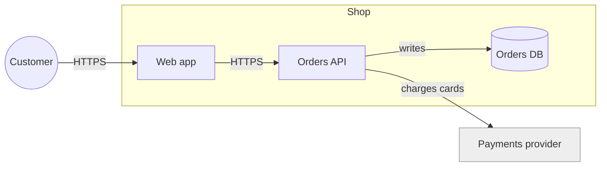
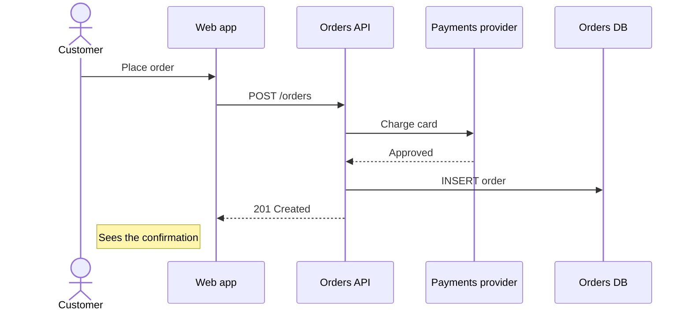

# Shop architecture

```mermaid
flowchart LR
  customer((Customer))
  subgraph shop [Shop]
    web[Web app]
    api[Orders API]
    db[(Orders DB)]
  end
  payments[Payments provider]
  customer -->|HTTPS| web
  web -->|HTTPS| api
  api -->|writes| db
  api -->|charges cards| payments
  click payments "https://payments.example.com/docs"
  classDef external fill:#eee,stroke:#999
  class payments external
```

```mermaid
sequenceDiagram
  actor customer as Customer
  participant web as Web app
  participant api as Orders API
  participant payments as Payments provider
  participant db as Orders DB
  customer->>web: Place order
  web->>api: POST /orders
  api->>payments: Charge card
  payments-->>api: Approved
  api->>db: INSERT order
  api-->>web: 201 Created
  Note right of customer: Sees the confirmation
```
